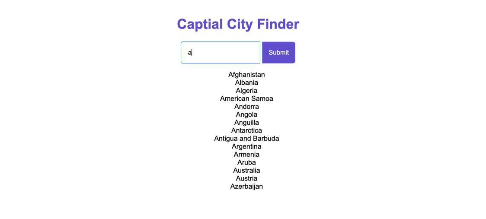

# Capital City Finder

Capital City Finder is a small full-stack project that lets you look up the capital city for any country. A Spring Boot API serves country/capital data backed by PostgreSQL, and a lightweight HTML/CSS/JS frontend provides autocomplete suggestions and displays the result.



## Stack
- Spring Boot 3, Java 17, Maven
- PostgreSQL + Spring Data JPA
- Vanilla HTML/CSS/JavaScript
- Docker and Docker Compose for local orchestration

## How it works
- The backend seeds country/capital pairs from `country-by-capital-city.json` into PostgreSQL at startup.
- REST endpoints expose the dataset: list all countries or fetch a single country by name (case-insensitive).
- The frontend calls the API, provides typeahead suggestions, and shows the capital or a helpful error message.

## Running with Docker Compose (recommended)
1) Create a `.env` file at the project root with your database credentials:
```
POSTGRES_USER=capital_user
POSTGRES_PASSWORD=capital_pass
POSTGRES_DB=capital_db
```
2) Start the stack:
```
docker compose up --build
```
3) Frontend: serve the contents of `frontend/` from an allowed origin (`http://127.0.0.1:5500`, `http://localhost:5500`, or `http://localhost:3000`; e.g., VS Code Live Server or `python -m http.server 5500`), then open the page in your browser.
4) Backend API: available at `http://localhost:8080`.

## Running locally without Docker
1) Start PostgreSQL and create a database.
2) Export environment variables for Spring Boot (values should match your local DB):
```
export SPRING_URL=jdbc:postgresql://localhost:5432/capital_db
export SPRING_USERNAME=your_db_user
export SPRING_PASSWORD=your_db_password
```
3) Boot the API:
```
cd backend
./mvnw spring-boot:run
```
4) Serve the frontend (`http://127.0.0.1:5500`, `http://localhost:5500`, or `http://localhost:3000` are allowed for CORS):
```
cd frontend
python -m http.server 5500
```
5) Open `http://127.0.0.1:5500` and search for a country.

## Tests
- Backend unit tests cover `CountryService` (mapping DB results to DTOs) and `CountryController` (JSON shape and status codes via `@WebMvcTest` with mocked service).
- Run all backend tests:
```
cd backend
./mvnw test
```
- Frontend Jest tests cover client helpers (e.g., `getCountry` contract with the API module).
```
cd frontend
npm test
```

## API
- `GET /countries` — returns all country/capital pairs.
- `GET /countries/{countryName}` — returns a single entry; 404 if not found.

Example:
```
curl http://localhost:8080/countries/France
```
Response:
```json
{"country":"France","capital":"Paris"}
```
The API returns a DTO without the database `id`, exposing only the country and capital fields.

## Frontend use
- Start typing a country to see suggestions.
- Click a suggestion or submit to fetch the capital.
- Validation and errors are surfaced inline (e.g., missing input, country not found).

## Project layout
- `backend/` — Spring Boot service, JPA entities, seed loader, API controllers.
- `frontend/` — static HTML/CSS/JS client.

## Notes
- Seed data loads on every backend start (existing rows are cleared first).
- Swagger UI is available when running the backend at `http://localhost:8080/swagger-ui.html`.

*README generated using Codex.
